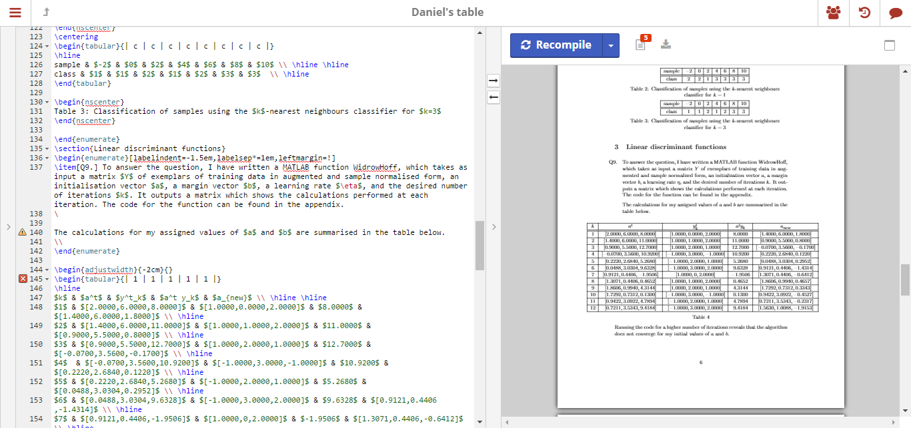

# (PART) 基础 {.unnumbered}

# 认识 R Markdown {#know-rmarkdown}

本章简要介绍 R Markdown 在工具层面的渊源, 它解决了什么问题，我们能用它来干什么, 以及与类似工具的比较。喜欢从实操开始的读者可以跳过本章，从 第 \@ref(installation) 章开始。如果读者已经掌握了 R Markdown 的基础知识，书写过一些 R Markdown 的文档, 也可以直接开始阅读第 \@ref(document) 章。

## Markdown 和 R Markdown

介绍 R Markdown，要先从排版软件的演变说起。

曾经，所有写作工具的诞生均服务于印刷出版质量。此中翘楚便是 1978 年由计算机科学家高德纳设计的 TeX。TeX 提供了一套功能强大并且十分灵活的排版语言，且用户可以自定义新的指令，这使它几乎可以事无巨细地包含所有排版效果。虽然 Tex 可以生成精美的文档，它的精密也造就了陡峭的学习曲线和复杂晦涩的文档结构，有丰富编程技巧的程序员也常常望而却步。

为了让降低 Tex 的门槛，LaTeX 在八十年代出现了，它包装了许多 TeX 的低级指令，让排版人员可以使用更简洁的指令。但即便如此，用 LaTeX 写作仍是件稍显阳春白雪的事情。TeX 和 LaTeX 也代表了早期写作排版工具的一种范式：用原始文档中用符号标记指代排版效果，我们只能在原始文档输出之后看到实际效果。例如下面的 LaTeX 文档，原始文档仅仅包含纯文本，用 `\{}` 命令标识编译后 PDF 文档的排版效果

```{r, echo = FALSE, fig.cap="左: 原始文档；右：经过编译后的 PDF 文件"}

```

另一种范式的代表工具便是 Microsoft Word, 也接触过它的排版功能。Word 的相对于 TeX 的一大特点在于所有编辑都是 "所见即所得" 的。我们在选中一段文字后点击加粗，它在文档里就变成了粗体，打印出来也是粗体。这使作者摆脱了复杂的 TeX 和 LaTeX 指令，几乎消除了写作在技术上的难度。

Word 中所见即所得的设计也有它的代价，文档变得难以维护。虽然依赖图形界面的操作门槛更低，作者却时常需要为了某个排版效果大量重复某一操作。

网络时代到来之后，HTML 语言成为服务于 Web 的写作框架

R 是一门专长于统计计算与分析的语言。R 的用户经常有产出分析报告和研究文档的需求。

**knitr** 在 2012 年引入的。由于 R Markdown 提供了。

2014 年， `` `rmarkdown` `` 包诞生了。它建立在 `.Rmd` 这一文件格式上，提供相应的函数将 Knitr 生成的 Markdown 文件进一步转换为各种常见格式，包括 HTML，PDF，Word 等。用户可以在 Rmd 文档里

## R Markdown 的用途 {#rmarkdown-gallery}

近几年，建立在 R Markdown 文档格式上的扩展包蓬勃发展，逐渐形成了一个完整的生态体系。对于 R Markdown 的扩展主要是通过修饰 HTML，PDF，Word 等基础格式输出实现的，且往往也以包的形式存在。 `rmarkdown` 将更新对应的默认输出设置为扩展包的设置，完成从源文档到输出文档的转换。 这些扩展包极大的丰富了 R Markdown 的用途。

下面我们快速浏览一些 R Markdown 的扩展用例，读者也可以在 [Github](https://github.com) 上以 R Markdown 为关键词探索各式各样的输出格式。

### 分析报告和毕业论文

PDF 分析报告和毕业论文的

### 简历

### 交互报表

### 个人网站

### 电子书

## 

## R Markdown 的朋友们

[LaTeX](https://www.latex-project.org/)

[Jupyter Notebook](https://jupyter.org/)

[Observable](https://observablehq.com/)

## 更大的视角

简要介绍文学编程和可重复性研究

"文学式编程" 作为一种编写程序的方法论由计算机科学家高德纳于 1984 年提出 \@ref(10.1093/comjnl/27.2.97)。一个按照文学编程思想撰写的程序有两个主要组成部分: 用于引领读者逻辑的文字和执行计算的代码。代码和文字在整个程序中交替出现，程序员应该用自然语言（例如中文）叙述任务的逻辑和实现思路，随后用代码段完成具体的计算。当相应的软件运行程序时，它不仅运行代码得到计算结果，生成数字和图片， 也能自动地把这些文字和计算结果组合成可供展示的文档。这样既方便了其他人的协作和二次开发，也节省了自己重复撰写例行文档的实践

现今，文学式编程的思想在数据科学和科学计算等领域内得到了广泛应用。
