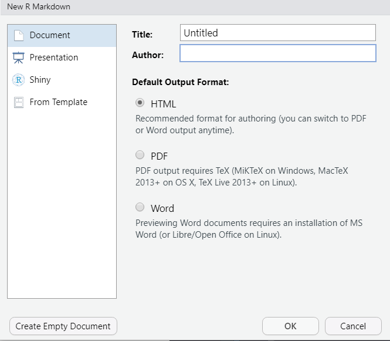
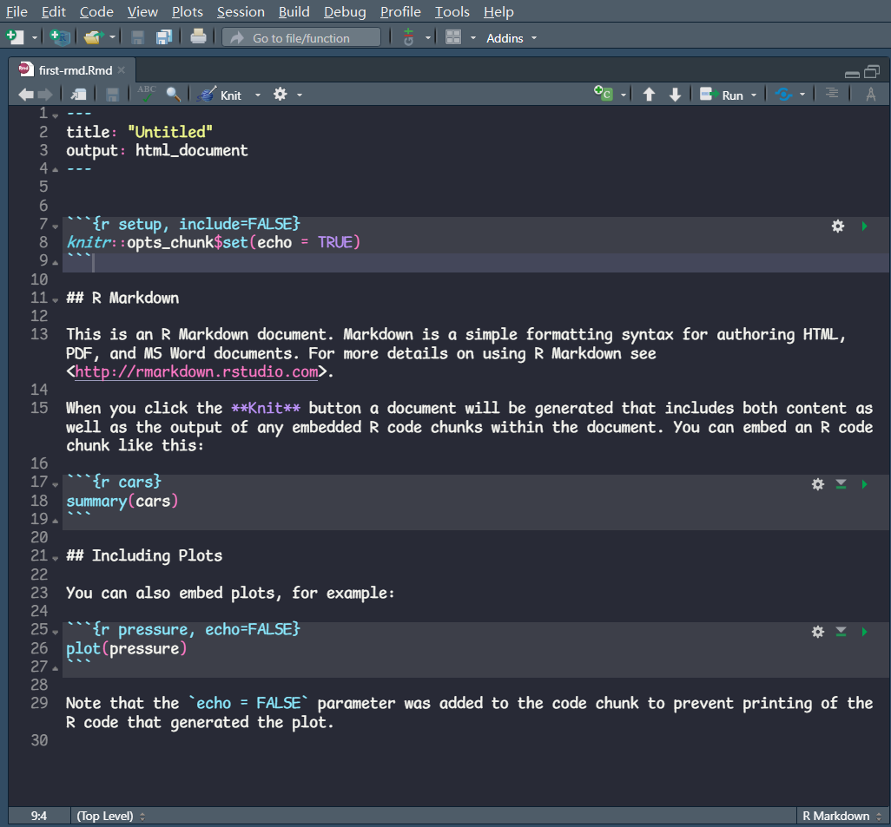

# 安装 {#installation}

本章介绍安装 R Markdown 相关依赖包的方法，并编译第一个 R Markdown 源文档，输出为 HTML 格式。

## 安装 R Markdown 

编译 R Markdown 文档需要安装 `rmarkdown` 包, 在 RStudio 的控制台中运行

```{r, eval = FALSE}
install.packages("rmarkdown")
```

中国大陆的读者有可能遇到网络问题，这时可以在 RStudio 的 `Tools --> Global Options --> Packages` 将 Primary Cran Repository 更改为国内的镜像。也可以在 `install.pckages` 中设置 `repos` 参数

```{r, eval = FALSE}
install.packages("rmarkdown", repos = )
```

## 创建第一个 R Markdown 文档

安装完成后，我们可以开始创建第一个 R Markdown 文档。在 RStudio 中选择 `File --> New File --> R Markdown`, 弹出以下提示框

```{r, echo = FALSE}

```
在这里可以提前设定输出文档的标题，作者和格式。这里我们保留默认设置，点击 OK 即可。

随后，RStudio 编辑器内生成了如下图的文档

```{r first-rmd-content, echo = FALSE, fig.cap = "RStudio 默认创建的 R Markdown 源文档模板"}

```

图 \@ref(fig:first-rmd-content) 中的文件即为 R Markdown 的源文档，本书随后章节对文本和代码的编辑以及日常使用均是围绕类似这样的源文档展开的。

点击源文档顶部的 **Knit** 按钮，RStudio 首先提示应保存源文档，读者可以在不更改 `.Rmd` 文件后缀的情况下任意选择保存名称, 但不要包含中文。 保存后，R Markdown 包开始将源文档编译为输出。几秒后弹出以下界面说明编译成功，同时 R Markdown 包安装无误，可以开始快乐的写作了。 

```{r, echo = FALSE}
import_example_result("first-rmd.Rmd")
```

熟悉 R 的读者可能会疑惑，为什么我们没有用 `library(rmarkdown)` 导入 `rmarkdown` 包，也没有在源文档中运行相关的函数，编译仍能成功呢？当我们点击 Knit 的时候，RStudio 默默调用了

```{r, eval = FALSE}
# 第一个参数为你保存的文件名
rmarkdown::render("first-rmd.Rmd", output_format = "html_document")
```

读者不妨自己在控制台内运行一遍以上代码，看结果与点击 Knit 是否相同。


## 安装 Tinytex 

对于需要生成 PDF 文档的读者，还需要安装 **tinytex** 包

```{r, eval = FALSE}
# 安装 tinytex 包
install.packages("tinytex")
# 实际安装 tinytx 软件
tinytex::install_tinytex()
```

安装完成后，在 RStudio 中打开之前保存的 R Markdown 源文档，将第三行 `output_format: html_document` 更改为 `output_format: pdf_document`。点击 Knit 后，生成如下两页 PDF 文档，说明安装成功

```{r, fig.align='default', out.width = "49%", fig.show="hold", echo = FALSE}
knitr::include_graphics(rep(c("images/02-first-rmd-pdf1.png", "images/02-first-rmd-pdf2.png"), 1))
```


